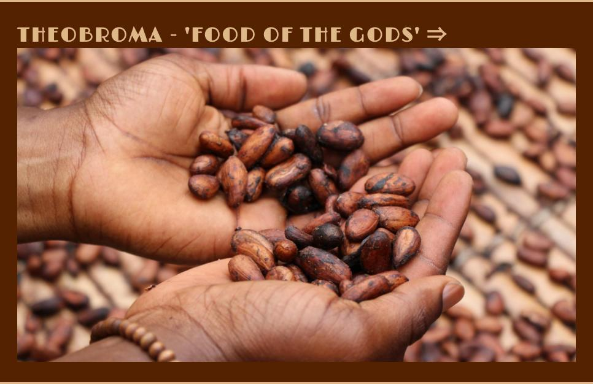

# Caffeine Story..

Caffeine story is fun and educational site targeted at caffeine consuming population, and ones to become. :D
Its goal is to connect experience of consuming various caffeine drinks with story behind it.
In that way we provide longterm value to user experience and ritual of drinking becomes more rich and meaningful.
Information is presented trough short stories and pictures to incite both logical and creative side and make information easier to digest.
Overall vibe and feel of site is retro, adventurous, inviting to explore, embark on a journey..

## Wireframes

Wireframes proved quite useful. Some features where implemented like main mage structure, intention of header, footer, etc.. Navbars where not implemented as imagined + few other smaller omits. Which is very understandable since its my first project. Im even surprised that i did not changed it even more! It was very challenging to tackle with so many data and learning in short time + demanding private responsibilities. Long days and sleepless nights, and i am very proud. exhausted and very happy actually! :D I enjoyed every single second of coding, all mistakes and sucesses, i just love it! It captivated me :) [Wireframes](assets/images/wireframes-md.jpg)

## Features

### Existing Features

* Header with unique stories, original writing, it brings character and uniquness to page and its mamde to capture readers imagination: 
* Navigation bar with active buttons for simple navigation between pages, good contrast, easy on eye: 
* Main page with visible header and section with brief overview and embedded link to wikipedia in header h2 if readers want to know more!: 
* Mobile phone preview, responsive: 
* Subpage with picture/gallery and different section color: 
* footer with contact and quotation in same style as header, purpose to provideshort inspiration: 

### Features Left to Implement

* Gallery page & media, social media links
* Expanding narrative, adding more articles, blog posts
* Possibility of adding e-commerce elements

## Testing

HTML and CSS validation was sucessful.
Page was also tested and validated with high score on Google Chrome Lighthouse with responsivness tests passed with high marks.
Page was also tested for responsiveness manually. Responsiveness rules where kept simple and minimal. Pictures, menu bar and text scale with size of screen properly.
Paragraph text of header has minor contrast/visibility issues when scaling down. To be improved. 

* Lighthouse score: 

### Validator Testing

* HTML: [W3C validator](https://validator.w3.org/nu/?doc=https%3A%2F%2Fdenisklopotan.github.io%2Fcaffeine-story%2F)
* CSS: [(Jigsaw) validator](http://jigsaw.w3.org/css-validator/validator?uri=https%3A%2F%2Fdenisklopotan.github.io%2Fcaffeine-story%2F&profile=css3svg&usermedium=all&warning=1&vextwarning=)

### Unfixed Bugs

/

## Deployement

- The site was deployed to GitHub pages. The steps to deploy are as follows: 
  - In the GitHub repository, navigate to the Settings tab 
  - From the source section drop-down menu, select the Master Branch
  - Once the master branch has been selected, the page will be automatically refreshed with a detailed ribbon display to indicate the successful deployment. 

The live link can be found here - https://denisklopotan.github.io/caffeine-story/

## Credits

### Content

* Text in section of homepage has been taken from [Medium](https://macromoltek.medium.com/caffeine-the-good-the-bad-and-the-history-a1bad46fcd06), [Culturalsurvival.org](https://www.culturalsurvival.org/publications/cultural-survival-quarterly/eyes-forest-0), https://www.wikipedia.org/ and partly written and comprised by me.

* Fonts used on webpage have been taken from https://fonts.google.com/

* Links in H2 target https://www.wikipedia.org/

### Media

* Background photo used for header and footer is taken from website "freeimages.com". Direct link is: https://www.freeimages.com/photo/coffee-1150357. Footer has been cropped to feed needs of website.

* Images that are displayed on html subpages are taken from https://unsplash.com/. Their names are kept original so its easy to track them. Images have been edited slightly.
